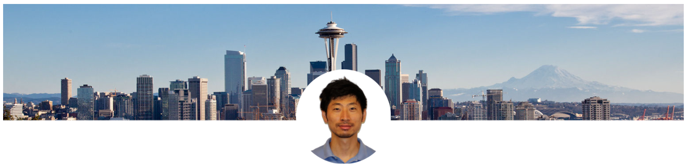

## Xin Zhao, Ph.D

I am an Assistant Professor in the Department of Computer Science at Seattle University. My research interests include Empirical Software Engineering, Model-Based Systems Engineering, Code Smells, and Systems Models Refactoring. I am also interested in Software Product Lines.

I obtained my Ph.D. in Computer Science in May 2021 from the Department of Computer Science at University of Alabama. My advisor was Dr. Jeff Gray. I received my B.E. at Hebei Normal University, China. Before joining the University of Alabama, I was a member of the National Engineering Research Center for Multimedia Software, Wuhan University, China.

Besides my research in Software Engineering and Model-Based Systems Engineering, I am also interested in Computer Science Education for K-12 (NSF #1639971, Department of Education - Education Innovation and Research).

During my free time, I like to workout and travel. I have a sweet tooth. Skiing and badminton are my passion.

I also enjoy writing.

## Open Positions
I am always looking for outstanding graduates and undergraduates who are interested in the areas of Empirical Software Engineering, Model-Based Systems Engineering, Code Smells, Systems Models Refactoring, and Computer Science Education. Please send me your CV if you are interested.

## News
- Mar 2026
[Team] Congratulations to my K–12 RA, Raehan, on receiving first place at the 2026 Washington State Science & Engineering Fair for the project Forecasting River Hypoxia Using USGS Sensor Data and Machine-Learning Classification Models.

- Mar 2026
[Paper] Our paper "Is Artificial Intelligence an Elixir to the Software Engineering Community? An Empirical Study Among Managers" was accepted by the 3rd ACM International Conference on AI-powered Software (AIware 2026). Congrats to my RA, Brian!

- Mar 2026
[Paper] Our paper "Mapping K–12 Educators’ Professional Learning Pathways to AI Literacy and Integration: An Empirical Study" was accepted by the 18th International Conference on Computer Supported Education. Congrats to my RA, Ai!

- Jan 2026
[Paper] Our paper "Personalized Medicine Meets Artificial Intelligence: A Systematic Literature Review" was accepted by AIHealth 2026. Congrats to my RA, Parth!

- Jan 2026
[Team] Congrats to my RA, Ai, for being accepted by the Technology Ethics Initiative Student-Scholar Program!

- Oct 2025
[Team] Thrilled to announce I'm collaborating with Dr. Li Huang from the Department of Criminal Justice at Seattle University and Dr. Hei Lam (Heidi) Chio from St Martin's University on a new research project. We are conducting an analysis of fraud in the peer-to-peer (P2P) online lending market.

- Aug 2025
[Paper] Our paper "AI-Crafted Narratives: An Empirical Study on Generating Interactive Stories Using Generative Pre-Training Transformers" was accepted by Applied Intelligence. Congrats to my students Ana Carolina de Souza Mendes, Mason Adsero, Joshua Palicka, and Nurulla Zholdoshov!

- Jun 2025
[Award] Congrats to my RA, Riley, for receiving the 2025 CS Outstanding Undergraduate Student Award!

- Apr 2025
[Team] Dr. Zhiju Yang starts his collaboration with our research team. We are working on applying LLM for automated vulnerability detection in Web3.

- Mar 2025
[Team] Ai Sun, an SU graduate student, joined our research team as a Research Assistant. She is working on the impact of AI on K-12 education in the computing field.

- Mar 2025
[Team] Brian Vu, an SU undergraduate student, joined our research team as a Research Assistant. He is working on the impact of AI on software professionals.

- Feb 2025
[Team] Yash Atre, an SU MS student, joined our research team as a Research Assistant. He is working on community smells detection tools.

- Jan 2025
[Team] Rishi Munuswamy, an SU MS student, joined our research team as a Research Assistant. He is working on community smells detection tools.

- Sep - Dec, 2024
[Team] I will be on my sabbatical leave for the Fall Quarter 2024. Big thanks to the College of Science and Engineering at Seattle University for offering me this opportunity.

- Aug 2024
[Paper] Our paper "Classifying Changes to LabVIEW and Simulink Models via Changeset Metrics" was accepted by Innovations in Systems and Software Engineering.

- Jun 2024
[Paper] Our paper "Ask or Tell: An Empirical Study on Modeling Challenges From LabVIEW Community" was accepted by the Journal of Computer Languages (COLA). Congrats, Gurshan!

- Apr 2024
[Offer] Congrats to my RA, Nars, for receiving a job offer from Costco Wholesale as a Software Engineer!

- Mar 2024
[Offer] Congrats to my RA Rupanshon for receiving a job offer from Hyundai Motor America as a Manager in Connected Car Technical Ops!

- Jan 2024
[Team] Jasmine Pletcher, an SU MS student, joined our research team as a Research Assistant. She is working on Computer Science Education for K-12.

- Jan 2024
[Team] Sai Supraj Madhavapeddi, an SU MS student, joined our research team as a Research Assistant. He is working on community smells in the practice of software development.

- Dec 2023
[Offer] Congrats to my RA Sonali for receiving a job offer from American Express as a Software Engineer II!

- Dec 2023
[Paper] Our paper "Early Career Software Developers - Are You Sinking or Swimming?" was accepted by The 42nd International Conference on Software Engineering (Society Track). Congrats, Nars!

- Oct 2023
[Team] Rupansh Phutela, an SU MS alumnus, joined our research team as a Research Assistant. He is working on software refactoring and pattern analysis, focusing on microservice architecture.

- Jul 2023
[Team] Parth Reshamwala, an SU MS student, joined our research team as a Research Assistant in July 2023! He is interested in the application of Artificial Intelligence in Personalized Medicine.

- Jun 2023
[Paper] Our paper "Popular Songs: The Sentiment Surrounding the Conversation" was accepted by the 19th anniversary of the International Conference on Advanced Data Mining and Applications (ADMA'23). Congrats, Julian!

- May 2023
[Award] Congratulations to Riley on her two recent awards - an NSF Travel Award ($3,367) to support her in traveling to Australia for ICSE 2023 and the Bannan Scholarship for 2023-2024 from Seattle University.

- Apr 2023
[Team] Sonali Desarda, an SU MS student, joined our research team as a Research Assistant! Her research interest is in the application of language models.

- Feb 2023
[Team] Nars (Narissa) Tsuboi, an SU MS student, joined our research team as a Research Assistant in Feb 2023! She is interested in the social aspects of software engineering and increasing diversity in STEM.

- Dec 2022
[Paper] Our paper "Workplace Discrimination in Software Engineering: Where We Stand Today" was accepted by The 41st International Conference on Software Engineering (Society Track). Congrats, Riley!

- May 2022
[Team] Julian Stefanzick, an SU undergrad, joined our research team as a Research Assistant in May 2022! He is currently working on mining software repositories with the help of Machine Learning techniques.

- May 2022
[Team] Riley Young, an SU undergrad, joined our research team as a Research Assistant in May 2022! She is currently working on empirical software engineering related to gender differences for software professionals.

- Jan 2022
[Team] Gurshan Rai, an SU undergrad, joined our research team as a Research Assistant in the Spring Quarter of 2022! He is currently working on mining software repositories.

[//]: # (## Posts)