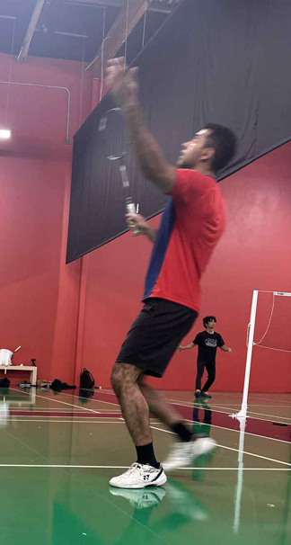
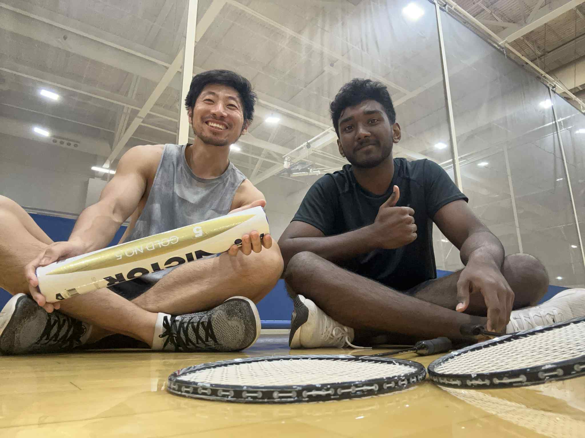
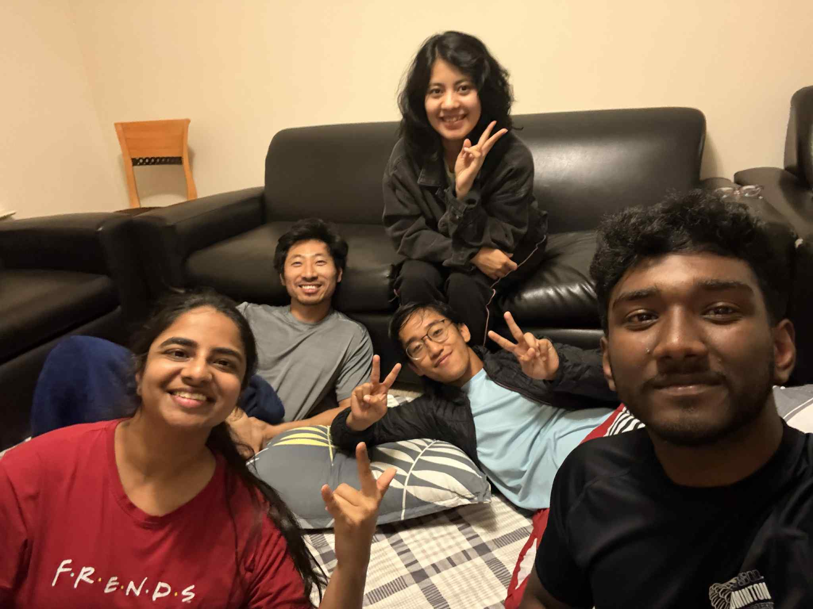

# How story begins...

For years, badminton was my language. Through the whirlwind of my undergrad and Master's, the court was my escape, my joy, my silent meditation.

But when I began my Ph.D., that language fell silent. I moved to a place where the familiar thwack of a birdie smash was a rare sound, and the sport I loved felt like a distant memory. My two rackets gathered dust in my closet, a quiet relic (they are over 10 years old) from a past life. For almost a decade, that part of me lay dormant.

Then came 2025, a year that would rekindle that forgotten flame.

In June, my friend, Nikhil, refused to let that story be the end. He gently pulled me back to the court, a place I hadn't set foot in for almost a decade. Though his skill level was way beyond mine, he motivated me to pick up my racket again. Once again, I found a spark on the badminton court. He didn't just hand me a racket; he handed me back a piece of myself I thought was lost.

That spark became a flame during my stay in Tennessee later in the summer. There, I was introduced to the badminton club at Middle Tennessee State University, and an unexpected, beautiful journey unfolded.

This is where I met my Coach, Niraj.

To him, I owe a debt of gratitude that is difficult to put into words. For the first time in my long, self-taught history with the sport, someone was showing me its true grammar. He saw not just what I was doing, but what I could do. Under his guidance, the chaotic movements of a lifetime began to find their purpose. For the first time, I felt I was truly learning badminton, not just playing it.

But more than that, we connected on a level that transcended the court. We discovered we had so much in common. In his passion, his drive, and his personality, I saw a reflection of myself. I always feel how amazing it is that such profound connections just happened in the most unexpected place.

This is also where I met my Tennessee Squad: Shaili, Akka (Hima), Zam, together with my Coach.

We five just clicked: we played board games at McDonald's all night, we sang loud in the car when hangout, we explored new places and new restaurants. It is a reminder that no matter how far we stray, the things we love can always find their way back to us. And it was the beginning of a new chapter, one filled with hope, friendship, and the rediscovery of joy. You guys turned my summer in Tennessee into a treasure trove of memories I'll carry forever.

The summer in 2025 was more than a return to a sport. It was a homecoming to a part of myself I had forgotten.

# Badminton Club @Seattle University

I am excited to announce that SU Badminton Club is officially formed! Please join us through SU Connect if you are interested.

Meeting time: 6-8 PM, Wednesday; 2-4 PM, Sunday. Location: RAC @UREC.

